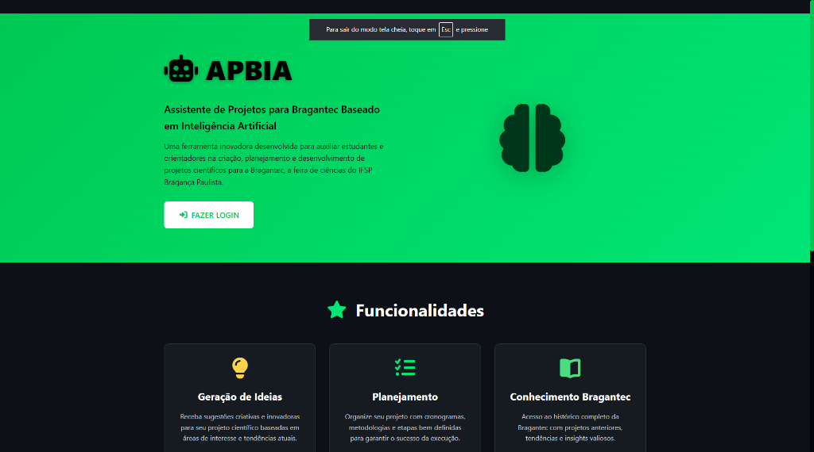
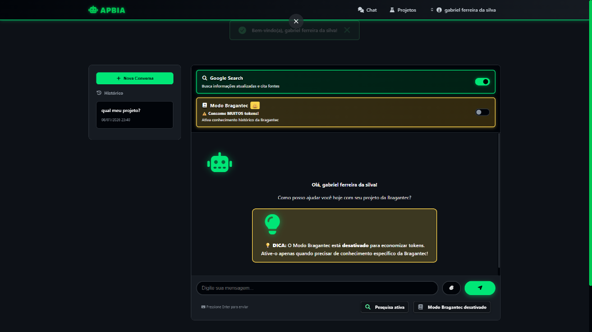

# 🤖 APBIA - Assistente de Projetos para Bragantec Baseado em IA

<div align="center">


**Sistema inteligente para auxiliar participantes e orientadores da Bragantec**

[🚀 Instalação](#-instalação) • [📖 Funcionalidades](#-funcionalidades) • [🛠️ Tecnologias](#️-tecnologias) • [📝 Licença](#-licença)

</div>

---

## 📋 Sobre o Projeto

O **APBIA** (Assistente de Projetos para Bragantec Baseado em IA) é uma plataforma web desenvolvida para auxiliar estudantes e orientadores na **Bragantec** - a feira de ciências e tecnologia do IFSP Campus Bragança Paulista.

O sistema utiliza o modelo **Google Gemini 2.5 Flash** com capacidades avançadas de:
- 💭 **Thinking Process** (raciocínio explícito)
- 🔍 **Google Search** integrado
- 🐍 **Code Execution** (execução de código Python)
- 📄 **Análise de arquivos** (imagens, PDFs, vídeos, áudios)

### 🎯 Objetivos

- Auxiliar no desenvolvimento de projetos científicos
- Sugerir ideias inovadoras baseadas em edições anteriores (2011-2019)
- Orientar sobre metodologia científica
- Facilitar a comunicação entre orientadores e participantes
- Gerenciar projetos e documentação

---

## 🚀 Instalação

### Pré-requisitos

- Python 3.11+
- Conta no [Supabase](https://supabase.com)
- Chave de API do [Google Gemini](https://ai.google.dev/)

### Passo a Passo

1. **Clone o repositório**
```bash
git clone https://github.com/seu-usuario/apbia.git
cd apbia
```

2. **Crie um ambiente virtual**
```bash
python -m venv venv

# Windows
venv\Scripts\activate

# Linux/Mac
source venv/bin/activate
```

3. **Instale as dependências**
```bash
python -X utf8 -m pip install -r requirements.txt
```

4. **Configure as variáveis de ambiente**

Crie um arquivo `.env` na raiz do projeto:
```env
SECRET_KEY=sua_chave_secreta_aqui

# Supabase
SUPABASE_URL=https://seu-projeto.supabase.co
SUPABASE_KEY=sua_anon_key_aqui

# Google Gemini
GEMINI_API_KEY=sua_api_key_gemini
```

5. **Configure o banco de dados**

Execute o script SQL no seu projeto Supabase:
- `schema.sql` (MySQL) ou
- `schema.psql` (PostgreSQL/Supabase)

6. **Inicie a aplicação**
```bash
python app.py
```

Acesse: `http://localhost:5000`

---

## 📖 Funcionalidades

### 👥 Tipos de Usuário

| Tipo | Descrição |
|------|-----------|
| **Administrador** | Gerencia todo o sistema, usuários, configurações e estatísticas |
| **Orientador** | Acompanha orientados, visualiza chats, adiciona notas e observações |
| **Participante** | Desenvolve projetos com auxílio da IA |
| **Anônimo (Guest)** | Acessa chat e projetos sem cadastro, dados salvos no navegador |

### 🤖 Chat com IA

- Interface de chat moderna e responsiva
- Histórico de conversas persistente
- Suporte a upload de arquivos (imagens, PDFs, áudios, vídeos)
- **Modo Bragantec**: Acesso ao contexto histórico completo (2011-2019)
- Controle de ferramentas (Google Search, Code Execution)
- Visualização do "Thinking Process" da IA

### 📊 Painel Administrativo

- Dashboard com estatísticas em tempo real
- Gerenciamento de usuários (CRUD)
- Estatísticas detalhadas do consumo do Gemini API
- Configurações do sistema (ativar/desativar IA)
- Gerenciamento de orientações (associar orientador ↔ projeto)
- Gerenciamento de participantes dos projetos

### 📁 Gestão de Projetos

- Criação e edição de projetos completos
- Campos estruturados (resumo, objetivos, metodologia, cronograma)
- Suporte a projetos continuados de edições anteriores
- Status de projetos (rascunho, em andamento, finalizado)
- Exportação para PDF

### 👨‍🏫 Área do Orientador

- Lista de orientados com informações detalhadas
- Visualização de chats dos orientados
- Sistema de notas por mensagem
- Observações gerais por participante

### 🔓 Modo Anônimo (Guest)

- Acesso sem cadastro via botão "Entrar Anonimamente"
- Chat completo com IA (mesmas funcionalidades do participante)
- Projetos salvos no **localStorage** do navegador
- Geração de ideias e autocompletar com IA
- Exportação de projetos para PDF
- **Limite Bragantec**: 1x por chat (igual ao modo normal)
- Conformidade com LGPD (política de privacidade integrada)
- Dados podem ser limpos a qualquer momento

---

## 🛠️ Tecnologias

### Backend
| Tecnologia | Versão | Uso |
|------------|--------|-----|
| Python | 3.11+ | Linguagem principal |
| Flask | 3.0.0 | Framework web |
| Flask-Login | 0.6.3 | Autenticação de sessões |
| Supabase | 2.24.0 | Banco de dados (PostgreSQL) |
| google-genai | 1.51.0 | Integração com Gemini |
| ReportLab | 4.0.7 | Geração de PDFs |
| bcrypt | 4.1.2 | Hash de senhas |

### Frontend
- HTML5 + Jinja2 Templates
- CSS3 (Design responsivo)
- JavaScript (ES6+)
- Fetch API para requisições assíncronas

---

## 📁 Estrutura do Projeto

```
apbia/
├── app.py                  # Aplicação principal Flask
├── config.py               # Configurações e variáveis de ambiente
├── requirements.txt        # Dependências Python
├── schema.sql              # Schema do banco (MySQL)
├── schema.psql             # Schema do banco (PostgreSQL)
│
├── controllers/            # Rotas e lógica de controle
│   ├── admin_controller.py     # Painel administrativo
│   ├── auth_controller.py      # Autenticação (login/logout)
│   ├── chat_controller.py      # Sistema de chat com IA
│   ├── guest_controller.py     # Modo anônimo (guest)
│   ├── orientador_controller.py # Área do orientador
│   └── project_controller.py   # Gestão de projetos
│
├── dao/                    # Data Access Object
│   └── dao.py                  # Operações com Supabase
│
├── models/                 # Modelos de dados
│   └── models.py               # Usuario, Projeto, Chat, etc.
│
├── services/               # Serviços externos
│   ├── gemini_service.py       # Integração Google Gemini
│   ├── gemini_stats.py         # Estatísticas de consumo
│   └── pdf_service.py          # Geração de PDFs
│
├── utils/                  # Utilitários
│   ├── advanced_logger.py      # Sistema de logs colorido
│   ├── decorators.py           # Decorators (@admin_required, etc.)
│   ├── helpers.py              # Funções auxiliares
│   ├── rate_limiter.py         # Rate limiting
│   └── session_manager.py      # Gerenciamento de sessões
│
├── templates/              # Templates HTML (Jinja2)
│   ├── base.html               # Layout base
│   ├── index.html              # Página inicial
│   ├── login.html              # Tela de login
│   ├── chat.html               # Interface do chat
│   ├── guest_chat.html         # Chat modo anônimo
│   ├── privacidade.html        # Política de privacidade (LGPD)
│   ├── admin/                  # Templates administrativos
│   ├── orientador/             # Templates do orientador
│   ├── projetos/               # Templates de projetos
│   └── guest_projetos/         # Projetos modo anônimo
│
├── static/                 # Arquivos estáticos
│   ├── css/                    # Estilos CSS
│   ├── js/                     # Scripts JavaScript
│   │   ├── guest_chat.js       # JS do chat anônimo
│   │   └── guest_projetos.js   # JS dos projetos anônimos
│   └── img/                    # Imagens
│
└── context_files/          # Contexto histórico da Bragantec
    ├── bragantec 2011.txt
    ├── bragantec 2012.txt
    └── ... (2011-2019)
```

---

## 🔐 Segurança

- ✅ Senhas hasheadas com bcrypt
- ✅ Proteção CSRF via Flask-WTF patterns
- ✅ Validação de sessão única por usuário
- ✅ Rate limiting para prevenção de abuso
- ✅ Decorators de autorização (@admin_required, @orientador_required)
- ✅ Timeout de sessão por inatividade
- ✅ Logs detalhados de todas as operações

---

## 📊 Estatísticas do Gemini API

O sistema inclui monitoramento completo do consumo da API:
- Tokens de entrada/saída por requisição
- Contagem de buscas no Google
- Histórico por usuário
- Limites configuráveis por período
- Exportação de dados em JSON

---

## 🎨 Screenshots

### Página Inicial


### Interface do Chat


---

## 🤝 Contribuindo

1. Faça um Fork do projeto
2. Crie uma branch (`git checkout -b feature/nova-funcionalidade`)
3. Commit suas mudanças (`git commit -m 'Adiciona nova funcionalidade'`)
4. Push para a branch (`git push origin feature/nova-funcionalidade`)
5. Abra um Pull Request

---

## 👨‍💻 Autor

**Gabriel Ferreira da Silva**

Estudante do Ensino Médio Integrado ao Técnico em Informática  no IFSP Campus Bragança Paulista

Projeto desenvolvido para a disciplina de **Projeto Integrador (PJI)**

---

## 📝 Licença

Este projeto está sob a licença MIT. Veja o arquivo [LICENSE](LICENSE) para mais detalhes.

---

## 🙏 Agradecimentos

- IFSP Campus Bragança Paulista
- Professores e orientadores do curso
- Comunidade Bragantec
- Google Gemini API
- Supabase

---

## 📋 Changelog

### v1.1.0 - 08/01/2026
- ✨ **Modo Anônimo (Guest)**: Acesso completo sem cadastro
  - Chat com IA igual ao participante
  - Projetos salvos no localStorage
  - Geração de ideias e autocompletar com IA
  - Exportação PDF
  - Botão verde no login: "Entrar Anonimamente"
- 🔒 **LGPD Compliance**: Página de política de privacidade
- ⚠️ **Limite Bragantec**: 1x por chat para todos os usuários
- 🎨 **UI**: Banner verde para modo anônimo
  ⚠️**AVISO** isso está em fase beta, erros podem ocorrer, use o modo login por enquanto 

### v1.0.0 - dezembro/2025
- 🚀 Lançamento inicial
- 💬 Chat com Gemini 2.5 Flash
- 👥 Sistema de usuários (Admin, Orientador, Participante)
- 📁 Gestão completa de projetos
- 📊 Painel administrativo com estatísticas

---

<div align="center">

**Feito com ❤️ para a Bragantec**

⭐ Se este projeto foi útil, considere dar uma estrela!

</div>
